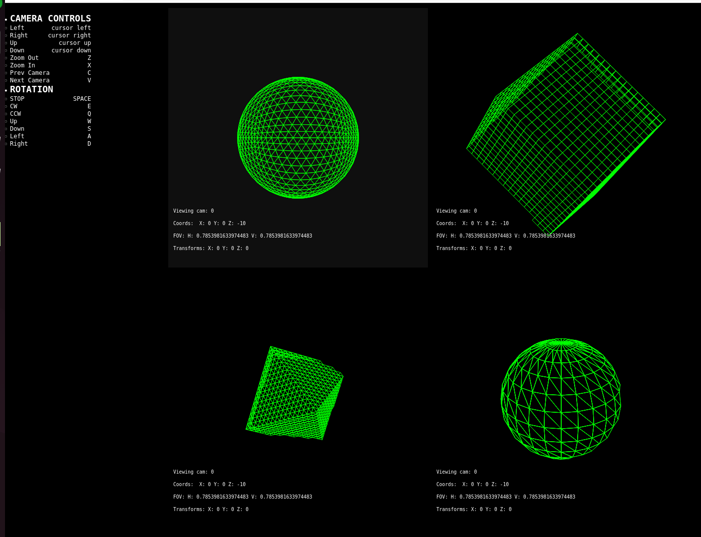

# A Javascript implementation of 3D rendering

Basic 3D implementation in JS and Canvas



## How

```
$ open index.html
```

## Why

At some point I wondered how 3D rendering works and found out about 3D transformations. Eventually I also read
OpenGL documentation, and above everything else, I remember the method for building the triangle meshes from a list
of points clicked with me.

So I thought I was ready to try and write something to help sink in the ideas.

It's entirely hand-written-home-grown-organic-standalone javascript code, which fills me with unhealthy pride. 
(It does use a little bit of JQuery, though...)

I wrote:

- Camera logic
- Render logic
- Models

...but what I like best is...

```
function octahedron(){

	var vertices = [
		new Vertex( 1.0, 0.0, 0.0),
		new Vertex(-1.0, 0.0, 0.0),
		new Vertex( 0.0, 1.0, 0.0),
		new Vertex( 0.0,-1.0, 0.0),
		new Vertex( 0.0, 0.0, 1.0),
		new Vertex( 0.0, 0.0,-1.0)
	];
	
	var triangles = [
		[ 0, 4, 2 ],
		[ 2, 4, 1 ],
		[ 1, 4, 3 ],
		[ 3, 4, 0 ],
		[ 0, 2, 5 ],
		[ 2, 1, 5 ],
		[ 1, 3, 5 ],
		[ 3, 0, 5 ]
	]
	
	var vList = modelToVertexList(vertices, triangles);
	
	for(i = 0; i < 4; i++){
		vList = fractalTriangles(vList);
    }
	
	return vList;

    
}

function triadSphere(){
    return normalizeVertex(octahedron());
}

function normalizeVertex(vxl){

    var length = 1;

    for(i in vxl){
        for(n in vxl[i].vx){   

            vx =  vxl[i].vx[n];

            dv = new Vertex(vx.x, vx.y, vx.z);
                       
            m = vectorDistance3D(new Vertex(0, 0, 0), vx);  
                        
            vxl[i].vx[n].x = dv.x * (length / m);
            vxl[i].vx[n].y = dv.y * (length / m);
            vxl[i].vx[n].z = dv.z * (length / m);            
        
        }
        
    }
    return vxl;
}
```

Check it out :) 

## APOLOGY

It's 2026. If people can brag about NOT writing code, I can flex about the code I write.